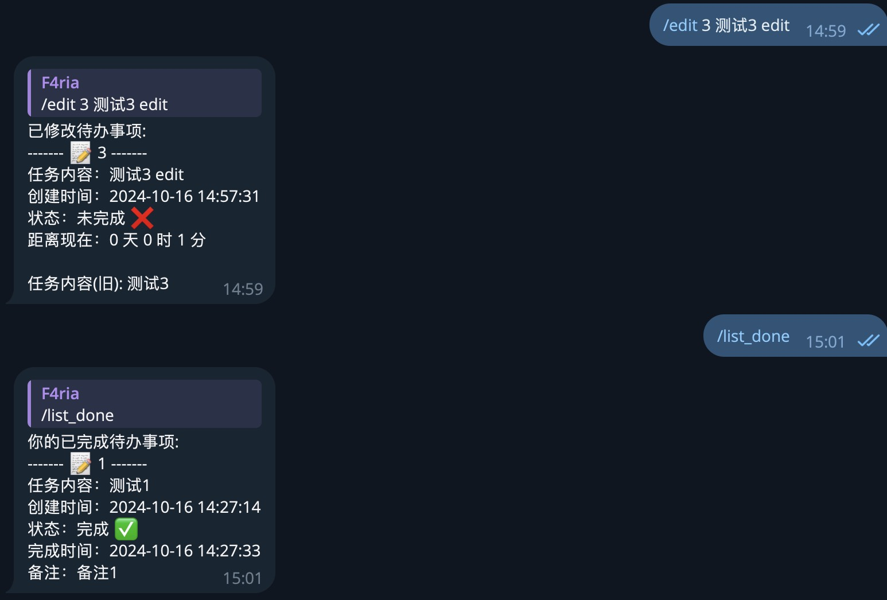

# LiteToDoBot

LiteToDoBot is a simple Telegram bot designed to help you manage your tasks efficiently with ease. With LiteToDoBot, you can easily add, list, edit, and delete tasks right from your Telegram chat.



## Commands

The bot supports the following commands:

| Command         | Description                            |
|-----------------|----------------------------------------|
| `/add [task]`   | Add a new task to your to-do list.      |
| `/list`         | Show all incomplete tasks.             |
| `/list_done`    | Show all completed tasks.              |
| `/list_all`     | Show all tasks (completed & incomplete).|
| `/edit [id] [description]` | Edit the description of a task.|
| `/complete [id]`| Mark a task as completed.               |
| `/note [id] [note]` | Add a note to a task.     |

## Installation

1. **Clone the repository**:

   ```bash
   git clone https://github.com/Fariacool/LiteToDoBot.git
   cd LiteToDoBot
   ```

2. **Install dependencies**:

   Ensure you have Python 3.x installed. Then install the required packages using `pip`:

   ```bash
   pip install -r requirements.txt
   ```

3. **Set up the bot token**:

   - Obtain a bot token from [BotFather](https://t.me/BotFather) on Telegram.
   - setting your token:

     ```python
     export lite_todo_tg_token="$your_tg_token"
     ```

4. **Run the bot**:

   ```bash
   python lite_todo_bot.py
   ```


## Example Usage

- **Adding a Task**:
  
  ```text
  /add Buy groceries
  ```

- **Listing Incomplete Tasks**:

  ```text
  /list
  ```

- **Editing a Task**:

  ```text
  /edit 1 Buy groceries and drinks
  ```

- **Marking a Task as Completed**:

  ```text
  /complete 1
  ```

- **Adding a Note to a Task**:

  ```text
  /note 1 Remember to buy fresh milk
  ```

## Customization

You can modify the bot to fit your specific needs. For example, you can add more commands, modify the database schema, or customize the bot’s behavior.
